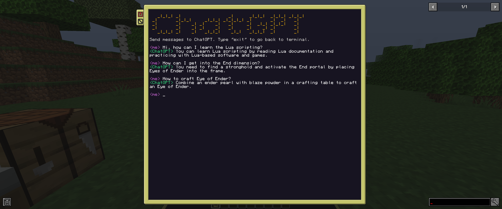

# cc-chatgpt



## Introduction
  
ChatGPT program for the ComputerCraft mod in Minecraft.  
  
CC programs (Lua scripts) can connect with programs outside Minecraft using the HTTP API.
Therefore I wrote a local Python server, which handles HTTP requests, talks to ChatGPT, and brings the ChatGPT responses back into the game.
  
## Prerequisites
  
- OpenAI API key
- Python installed
- Python modules installed: Flask, Dotenv, OpenAI
  
## Installation
  
Install Python (Python3) from the [Python website](https://www.python.org/).  
  
Install the Python modules with pip:  
```bash
pip install Flask
pip install python-dotenv
pip install openai
```
  
Copy the contents of this repository to a directory of your preference by using the clone command:
```bash
git clone https://github.com/eldiankyo/cc-chatgpt.git
```
  
Within the root directory of the folder, create a new file named ".env" and include the following content:
```bash
API_KEY=YOUR_API_KEY
```
Paste your [OpenAI API](https://platform.openai.com/account/api-keys) key instead of YOUR_API_KEY.

  
Locate the **Minecraft folder** on your computer. The location depends on your operating system:  
  
**For Windows:** Find the folder in the **Application Data** directory. To access this, you need to open the Run command (Windows key + R), type in %APPDATA% and press Enter. Look for the "minecraft" folder in the window that opens up.  
  
**For Unix/Linux:** It's usually located in the **Home** directory. You can find it by opening the terminal and typing:
```bash
cd ~/.minecraft
```
  
Once you're inside the **"minecraft"** folder, find and open the **"saves"** folder. Inside this, you'll find folders for all of your saved worlds. Open the folder named after the world where you want to use "chatgpt".  
  
Inside your world's folder, find and open the **"computercraft"** folder.  
  
Within the **"computercraft"** folder, you will find folders with numerical names (e.g., 0, 1, 2...). These folders represent the CC computers you have.  
  
You need to copy the **"chatgpt.lua"** file into these numerical folders where you want to use chatgpt.  
  
  
Open the **"minecraft-folder/saves/your-world/serverconfig/computercraft-server.toml"** file, and add these lines to whitelist our server:  
  
```bash
# You can modify the IP address here,
# but then don't forget to modify the one in the "server.py" file too!
[[http.rules]]
	host = "127.0.0.0/8"
	action = "allow"
 
[[http.rules]]
	host = "$private"
	action = "deny"
```

Now you can start the server from a terminal window:
```bash
python server.py
```  
Or:
```bash
python3 server.py
```

And in the game on a computer which has the "chatgpt.lua" file:
```bash
chatgpt
```

Have fun!
