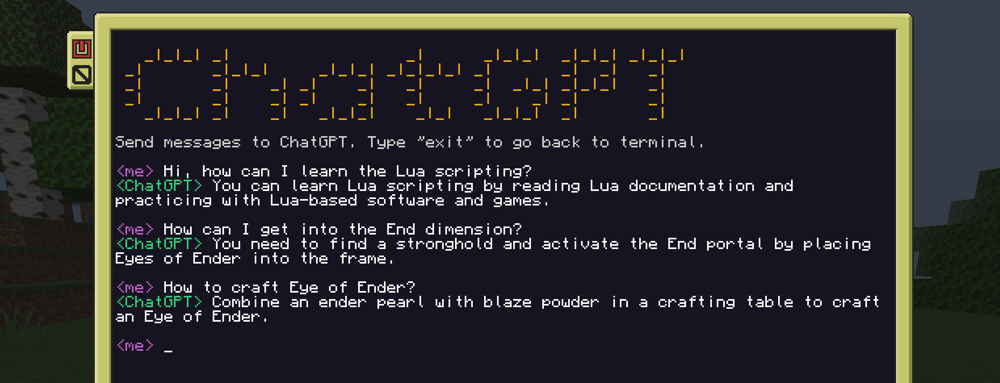

# cc-chatgpt



## Introduction
  
ChatGPT program for the ComputerCraft mod in Minecraft.  
  
CC programs (Lua scripts) can connect with programs outside Minecraft using the HTTP API.
Therefore I wrote a local Python server, which handles HTTP requests, talks to ChatGPT, and brings the ChatGPT responses back into the game.
  
## Prerequisites
  
- OpenAI API key
- Python installed
- Python modules installed: Flask, Dotenv, OpenAI
  
## Installation
  
Install Python 3 from the [Python website](https://www.python.org/).  
  
Install the Python modules with pip:  
```bash
pip install Flask
pip install python-dotenv
pip install openai
```
  
Download the server.py file from this repository to a directory of your preference.
  
Within the root directory of the folder, create a new file named ".env" and include the following content:
```bash
API_KEY=YOUR_API_KEY
```
Paste your [OpenAI API](https://platform.openai.com/account/api-keys) key instead of YOUR_API_KEY. Save and then close the file.
  
The folder structure should look like this:  

📦my-folder  
 ┣ 📜.env  
 ┗ 📜server.py  
  
  
Locate the **Minecraft folder** on your computer. The location depends on your operating system:  
  
**For Windows:** Open the Run command (Windows key + R), type in %APPDATA% and press Enter. Look for the "minecraft" folder in the window that opens up.  
  
**For Unix/Linux:** It's usually located in the **Home** directory. You can find it by opening the terminal and typing:
```bash
cd ~/.minecraft
```
  
Once you found your **"minecraft"** folder, open the **"minecraft-folder/saves/your-world/serverconfig/computercraft-server.toml"** file, and add these lines to whitelist your local server:  
  
```bash
[[http.rules]]
	host = "127.0.0.1/8"
	action = "allow"
```

Now you can start the server:
- Open a terminal window / command line
- Navigate to the folder where you have the **server.py** and the **.env** files
- Run the server by entering:
```bash
python server.py
# or
python3 server.py
```

Open Minecraft, go to a computer, and paste the following into the CraftOS terminal:
```bash
wget https://raw.githubusercontent.com/eldiankyo/cc-chatgpt/main/chatgpt.lua
```
After it downloaded the chatgpt.lua file, you can start it by typing:
```bash
chatgpt
```

To close the server:
  - Click the terminal/command line window and press **Ctrl + C**  
  
To close the ingame program:  
  - Send "exit" to ChatGPT or press and hold **Ctrl + T**
